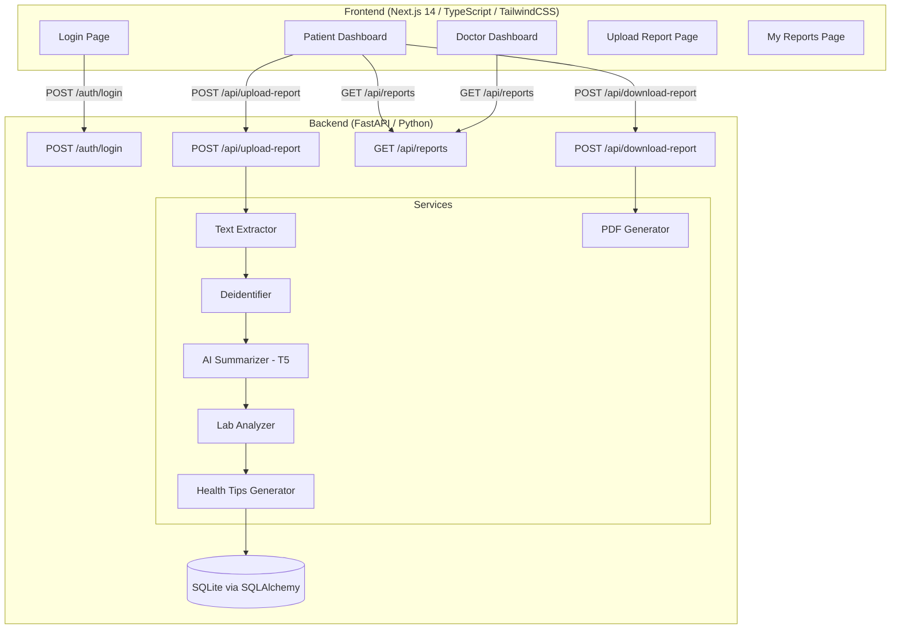

# Design Document: Medical Insight AI

## Overview

Medical Insight AI is a full-stack web application with a clear separation between a Next.js 14 frontend and a Python FastAPI backend. The backend handles all AI processing, file management, and data persistence. The frontend provides role-specific dashboards for patients and doctors. Communication between layers is via REST API with JWT authentication.

The AI pipeline processes uploaded medical reports through a sequential chain: file ingestion → text extraction → deidentification → T5 summarization → lab value analysis → health tip generation → persistence.

---

## Architecture



### Request Flow

1. User logs in via the login page; frontend stores JWT in `localStorage`.
2. All subsequent API calls include `Authorization: Bearer <token>`.
3. On upload, the backend runs the full processing pipeline and returns structured JSON.
4. The frontend renders results in the appropriate dashboard based on the user's role.
5. On download, the backend generates a PDF and streams it back to the browser.

---

## Components and Interfaces

### Backend Components

#### `app/main.py`
FastAPI application entry point. Registers routers, configures CORS to allow the Next.js dev server (`http://localhost:3000`), and initializes the database on startup.

#### `app/config.py`
Centralizes configuration: JWT secret key, algorithm, token expiry, upload directory path, and model name (`t5-small`).

#### `app/database.py`
SQLAlchemy engine and session factory for SQLite. Exposes `get_db` dependency for FastAPI route injection.

#### `app/models/report.py`
SQLAlchemy ORM model for the `reports` table.

#### `app/routers/auth.py`
Handles `POST /auth/login`. Delegates to `Auth_Service`.

#### `app/routers/upload.py`
Handles `POST /api/upload-report`. Orchestrates the full processing pipeline by calling services in sequence.

#### `app/routers/reports.py`
Handles `GET /api/reports` and `POST /api/download-report`.

#### `app/services/auth_service.py`
Creates JWT tokens with role claims using `python-jose`.

#### `app/services/text_extractor.py`
Extracts text from PDF files using PyMuPDF (`fitz`) and from images using `pytesseract` + `pdf2image`.

#### `app/services/deidentifier.py`
Uses regex patterns to strip names and phone numbers from extracted text.

#### `app/services/model_loader.py`
Loads and caches the `t5-small` model and tokenizer at startup to avoid repeated loading.

#### `app/services/lab_analyzer.py`
Parses extracted text with regex to find lab values and compares them against hardcoded normal ranges.

#### `app/services/health_tips.py`
Maps abnormal lab results to predefined health tip strings.

#### `app/utils/pdf_generator.py`
Uses `reportlab` to generate a structured PDF from report data.

---

### Frontend Components

#### `app/page.tsx` (Login Page)
Form with a username input. On submit, calls `POST /auth/login`, stores the JWT, and redirects based on role.

#### `app/dashboard/patient/page.tsx`
Patient dashboard with sidebar. Sections: summary cards, upload form, results display (patient summary, lab table, health tips), report history list, download button.

#### `app/dashboard/doctor/page.tsx`
Doctor dashboard with sidebar. Sections: report list, clinical summary, lab analysis table, health status.

#### `components/Sidebar.tsx`
Shared sidebar navigation component. Renders links: Dashboard, Upload Report, My Reports, Health Trends.

#### `components/LabTable.tsx`
Renders a table of lab results with color-coded status badges (green = Normal, yellow = Low, red = High).

#### `components/ReportCard.tsx`
Displays a summary card for a single report entry.

#### `lib/api.ts`
Centralized API client. All fetch calls go through this module, which automatically attaches the `Authorization: Bearer` header from `localStorage`.

---

## Data Models

### Database Model: `Report`

```python
class Report(Base):
    __tablename__ = "reports"

    id: int                    # Primary key, auto-increment
    filename: str              # Original uploaded filename
    patient_summary: str       # Plain-language AI summary
    clinical_summary: str      # Medical-terminology AI summary
    overall_health_status: str # "Normal", "Attention Needed", or "Critical"
    created_at: datetime       # Timestamp of creation
```

### API Request/Response Schemas

#### `POST /auth/login` Request
```json
{ "username": "patient" }
```

#### `POST /auth/login` Response
```json
{ "access_token": "<jwt>", "token_type": "bearer", "role": "patient" }
```

#### `POST /api/upload-report` Response
```json
{
  "report_id": 1,
  "patient_summary": "...",
  "clinical_summary": "...",
  "lab_results": [
    { "test": "Hemoglobin", "value": 9.2, "status": "Low", "normal_range": "12-16" }
  ],
  "health_tips": ["Increase iron-rich foods such as spinach and lentils."],
  "overall_health_status": "Attention Needed"
}
```

#### `GET /api/reports` Response
```json
[
  {
    "id": 1,
    "filename": "report.pdf",
    "patient_summary": "...",
    "clinical_summary": "...",
    "overall_health_status": "Normal",
    "created_at": "2024-01-01T12:00:00"
  }
]
```

### Lab Normal Ranges

| Test         | Normal Range     | Unit    |
|--------------|-----------------|---------|
| Hemoglobin   | 12.0 – 16.0     | g/dL    |
| WBC Count    | 4.0 – 11.0      | ×10³/µL |
| Platelets    | 150 – 400       | ×10³/µL |
| Blood Sugar  | 70 – 100        | mg/dL   |
| Cholesterol  | 0 – 200         | mg/dL   |

---

## Correctness Properties

*A property is a characteristic or behavior that should hold true across all valid executions of a system — essentially, a formal statement about what the system should do. Properties serve as the bridge between human-readable specifications and machine-verifiable correctness guarantees.*

### Property 1: Lab classification covers all values

*For any* numeric lab value and its associated normal range, the Lab_Analyzer SHALL classify it as exactly one of `Normal`, `Low`, or `High` — never returning an unclassified result or multiple statuses.

**Validates: Requirements 4.2, 4.3, 4.4, 4.5**

---

### Property 2: Lab result structure completeness

*For any* detected lab test, the returned result object SHALL contain all four required fields: `test`, `value`, `status`, and `normal_range` — no field may be absent or null.

**Validates: Requirements 4.6**

---

### Property 3: Health tips coverage for abnormal values

*For any* set of lab results containing at least one `Low` or `High` classification, the Health_Tips_Generator SHALL return a non-empty list of health tips.

**Validates: Requirements 5.1**

---

### Property 4: Health tips absence for all-normal results

*For any* set of lab results where all values are classified as `Normal`, the Health_Tips_Generator SHALL return a response indicating no abnormal values (not an empty list of tips without explanation).

**Validates: Requirements 5.4**

---

### Property 5: JWT role claim round-trip

*For any* valid login request with username `doctor` or `patient`, decoding the returned JWT SHALL yield a role claim that exactly matches the submitted username.

**Validates: Requirements 1.1, 1.2, 1.5**

---

### Property 6: Report persistence after upload

*For any* successfully processed report upload, querying `GET /api/reports` SHALL return a list that includes a record with the same filename as the uploaded file.

**Validates: Requirements 6.4, 6.5**

---

### Property 7: Deidentifier removes PII

*For any* input text containing a phone number pattern or a name pattern, the Deidentifier SHALL return text that no longer contains those patterns.

**Validates: Requirements 2.5**

---

### Property 8: Upload pipeline produces both summaries

*For any* successfully uploaded and processed report, the response SHALL contain both a non-empty `patient_summary` and a non-empty `clinical_summary`.

**Validates: Requirements 2.6, 2.7, 3.4**

---

### Property 9: Invalid username returns error

*For any* login request where the username is not `doctor` or `patient`, the Auth_Service SHALL return a 400 error response — never a token.

**Validates: Requirements 1.3**

---

### Property 10: PDF generation produces valid output

*For any* valid report data object, the PDF_Generator SHALL return a non-empty byte sequence with `Content-Type: application/pdf`.

**Validates: Requirements 7.2, 7.3**

---

## Error Handling

| Scenario | HTTP Status | Response |
|---|---|---|
| Invalid username on login | 400 | `{ "detail": "Invalid username. Use 'doctor' or 'patient'." }` |
| Missing/invalid JWT on protected route | 401 | `{ "detail": "Not authenticated" }` |
| Unsupported file type on upload | 422 | `{ "detail": "Unsupported file type. Upload a PDF or image." }` |
| Report not found on download | 404 | `{ "detail": "Report not found." }` |
| Text extraction failure | 500 | `{ "detail": "Failed to extract text from the uploaded file." }` |
| AI model error | 500 | `{ "detail": "AI summarization failed." }` |

All errors follow FastAPI's standard `HTTPException` pattern with a `detail` field.

---

## Testing Strategy

### Dual Testing Approach

Both unit tests and property-based tests are required. They are complementary:
- Unit tests validate specific examples, edge cases, and error conditions.
- Property-based tests validate universal correctness across many generated inputs.

### Unit Tests

Focus areas:
- `lab_analyzer.py`: specific known values (e.g., Hemoglobin = 9.2 → Low)
- `deidentifier.py`: specific PII strings are removed
- `health_tips.py`: specific abnormal inputs produce expected tip strings
- `auth_service.py`: token creation and decoding
- API route integration: mock pipeline, assert response shape

### Property-Based Tests

Use **Hypothesis** (Python property-based testing library) with a minimum of **100 iterations per property**.

Each property test must be tagged with:
> `# Feature: medical-insight-ai, Property {N}: {property_text}`

| Property | Test Description |
|---|---|
| Property 1 | For any float value and normal range bounds, classification is always exactly one of Normal/Low/High |
| Property 2 | For any detected lab test, result object always has all 4 required fields |
| Property 3 | For any lab results list with ≥1 abnormal value, health tips list is non-empty |
| Property 4 | For any all-normal lab results list, health tips response signals no abnormalities |
| Property 5 | For any valid username (doctor/patient), JWT decode yields matching role claim |
| Property 6 | For any uploaded report, subsequent GET /api/reports contains that filename |
| Property 7 | For any text with phone/name patterns, deidentified output contains no such patterns |
| Property 8 | For any processed report, response contains non-empty patient_summary and clinical_summary |
| Property 9 | For any username that is not doctor or patient, login returns 400 |
| Property 10 | For any valid report data, PDF_Generator returns non-empty bytes with correct Content-Type |

### Frontend Tests

Use **Jest** + **React Testing Library**:
- Login form submits correct payload and stores token
- LabTable renders correct status badge colors
- API client attaches Authorization header on all requests
- Redirect to login when token is absent
